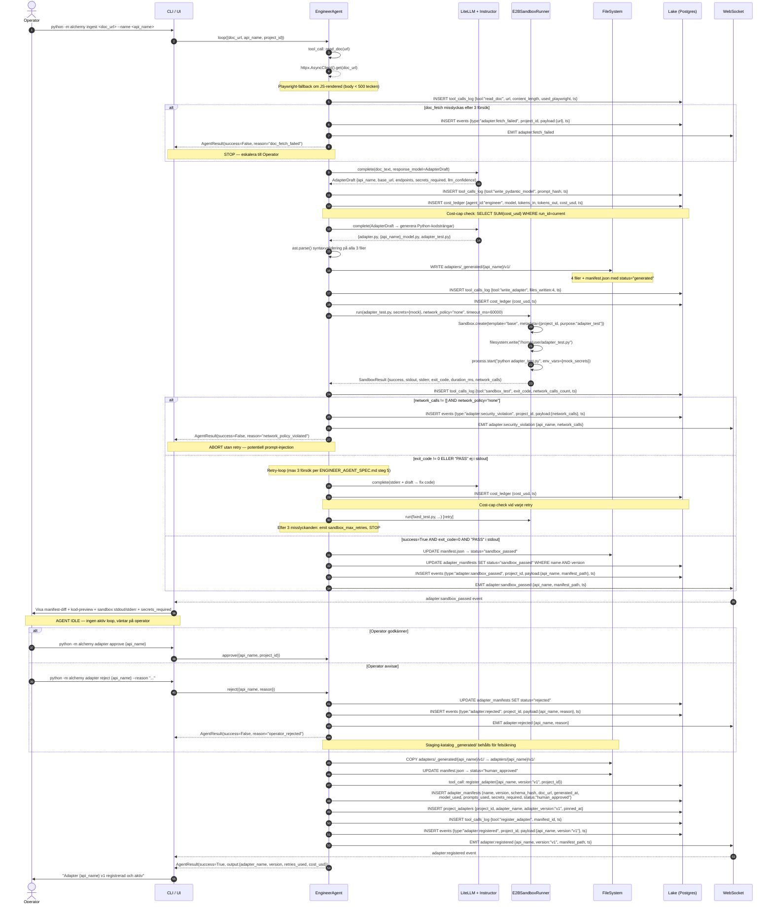

# ADAPTER_GENERATION_FLOW — Fas 3 Design

> Draft av Architect-draft (Sonnet). Review av Lead Architect (Opus) krävs innan Fas 3 öppnas.
> Datum: 2026-04-29. End-to-end-sekvensdiagram från `doc_url` till `adapter:registered`-event.
> Se ENGINEER_AGENT_SPEC.md och SANDBOX_INTEGRATION.md för detaljspec per komponent.

---

## 1. Komponent-legend

| Aktör / Komponent | Beskrivning |
|---|---|
| **Operator** | Människa (human-robin) som triggar och godkänner |
| **CLI / UI** | `python -m alchemy` (Fas 3) eller webb-UI (Fas 6) |
| **EngineerAgent** | `packages/agents/engineer/__init__.py` |
| **LiteLLM + Instructor** | LLM-lager, structured output via Instructor mot `AdapterDraft` |
| **E2BSandboxRunner** | `packages/sandbox/e2b_runner.py` — cloud-isolerad container |
| **FileSystem** | Lokal disk: `adapters/_generated/` (staging) och `adapters/` (aktiv) |
| **Lake** | Postgres + JSONB: `adapter_manifests`, `project_adapters`, `tool_calls_log`, `cost_ledger`, `events` |
| **WebSocket** | Gateway broadcast på topic `project:<id>` |

---

## 2. Huvud-sekvensdiagram



---

## 3. Events emitterade (kronologisk ordning)

| # | Event-typ | Topic | Trigger | Payload-nycklar |
|---|---|---|---|---|
| 1 | `adapter:fetch_failed` | `project:{id}` | read_doc misslyckas 3 gånger | `{url, attempt_count}` |
| 2 | `adapter:security_violation` | `project:{id}` | `network_calls != []` med `policy=none` | `{api_name, network_calls}` |
| 3 | `adapter:sandbox_passed` | `project:{id}` | exit_code=0 och "PASS" i stdout | `{api_name, manifest_path, sandbox_duration_ms}` |
| 4 | `adapter:rejected` | `project:{id}` | Operator kör `reject` | `{api_name, reason}` |
| 5 | `adapter:registered` | `project:{id}` | register_adapter slutförd | `{api_name, version, manifest_path}` |
| — | `adapter:cost_cap_hit` | `project:{id}` | `spent_usd >= cost_cap_usd` | `{api_name, spent_usd, cap_usd}` |
| — | `adapter:sandbox_max_retries` | `project:{id}` | 3 sandbox-fail | `{api_name, last_stderr, retries: 3}` |

Alla events skrivs till Lake `events`-tabellen (immutable append) med fälten:
```json
{
  "type": "adapter:registered",
  "project_id": "uuid-redacted",
  "payload": {"api_name": "open_meteo_forecast", "version": "v1", "manifest_path": "adapters/open_meteo_forecast/v1/manifest.json"},
  "ts": "2026-04-29T12:05:00Z"
}
```

---

## 4. Lake-tabeller skrivna/lästa

| Tabell | Operation | Steg | Nyckelkolumner |
|---|---|---|---|
| `tool_calls_log` | INSERT | 1, 2, 3, 5, 7 | `tool, input_hash, output_hash, cost_usd, ts, run_id` |
| `cost_ledger` | INSERT | 2, 3, retry | `project_id, agent_id:"engineer", model, tokens_in, tokens_out, cost_usd, ts` |
| `cost_ledger` | SELECT SUM | Före varje LLM-anrop | `WHERE run_id = current_run_id` — cost-cap guard |
| `adapter_manifests` | INSERT/UPDATE | 5 (sandbox_passed), 7 | `name, version, schema_hash, doc_url, generated_at, model_used, prompts_used, secrets_required, status` |
| `project_adapters` | INSERT | 7 | `project_id, adapter_name, adapter_version, pinned_at` |
| `events` | INSERT | Alla nyckel-händelser | `type, project_id, payload JSONB, ts` |
| `discovery_index` | READ (valfritt) | Pre-trigger (Fas 4) | `discovery_id, doc_url, api_name` — om Scout triggar Engineer |

---

## 5. Operator-godkännande: status-transition

```
  [loop() anropas]
        │
        ▼
   GENERATED ──► [ABORT: fetch_fail / cost_cap]
        │
        │  sandbox_test
        ▼
  ┌─────────────────────────────────────┐
  │ network_calls != [] → ABORT (R1)    │
  │ exit_code != 0 → retry (max 3)      │
  │ 3 retries → ABORT (sandbox_max)     │
  └──────────────┬──────────────────────┘
                 │ success=True, network_calls=[]
                 ▼
         SANDBOX_PASSED
                 │
                 │  WebSocket → Operator granskar preview
                 │  [AGENT IDLE — ingen aktiv loop]
                 │
         ┌───────┴────────┐
    [approve]         [reject]
         │                │
         ▼                ▼
  HUMAN_APPROVED      rejected
         │
         │  register_adapter (Lake + FS)
         ▼
        ACTIVE
         │
         │  (framtida Self-Repair eller manuellt)
         ▼
      DEPRECATED
```

**Human-in-the-loop position**: Övergången `SANDBOX_PASSED → HUMAN_APPROVED` kräver
explicit operator-aktion. Ingen timeout. Adaptern gör ALDRIG nätverksanrop mot riktig
API utan operatörens godkännande (per D4, ARCHITECTURE.md sektion 8, R1-mitigering).

---

## 6. Felvägar och eskaleringsmatris

| Felscenario | Adapter-status | Retry? | Operator-aktion krävs | Event |
|---|---|---|---|---|
| `doc_url` svarar ej (3 försök) | `GENERATED` (abort) | Nej | Ny URL eller manuell fetch | `adapter:fetch_failed` |
| Security violation (`network_calls != []`) | `GENERATED` (abort) | Nej | Granska genererad kod — möjlig prompt-injection | `adapter:security_violation` |
| Sandbox fail, max 3 retries | `GENERATED` (abort) | Uttömt | Manuell felsökning av stderr-log | `adapter:sandbox_max_retries` |
| Cost cap $5 nådd | `GENERATED` (abort) | Nej | Höj cap i config eller granska prompt-kvalitet | `adapter:cost_cap_hit` |
| Operator avvisar | `rejected` | Nej (ny run krävs) | Operatören har agerat — ny `loop()` vid behov | `adapter:rejected` |
| E2B rate-limit / downtime | N/A | Auto-fallback | Nej (om Codespaces ok) | — |
| Alla sandbox-backends fail | `GENERATED` (abort) | Nej | Kontrollera E2B + Codespaces status | `adapter:sandbox_max_retries` |

---

## 7. Koppling till andra system-loops

**Loop 1 — Self-discovering (Fas 4):**
Scout-agenten subscribe:ar på `adapter:registered` och uppdaterar sin ranking i
`discovery_index`. Scout emitterar `discovery:top_n_ready` → EngineerAgent kan
auto-triggas med `{doc_url, api_name}` från `discovery_index`. Flödet ovan är identiskt
oavsett trigger-källa (Operator direkt vs Scout).

**Loop 3 — Self-evaluating (Fas 5):**
`adapter:registered`-eventet (steg 8) → Judge-agenten subscribe:ar och startar
automatiskt benchmark → skriver till `arena_scores` → WebSocket uppdaterar leaderboard
→ Scout läser `arena_scores` för bättre framtida ranking. Compounding-effekt aktiveras.
